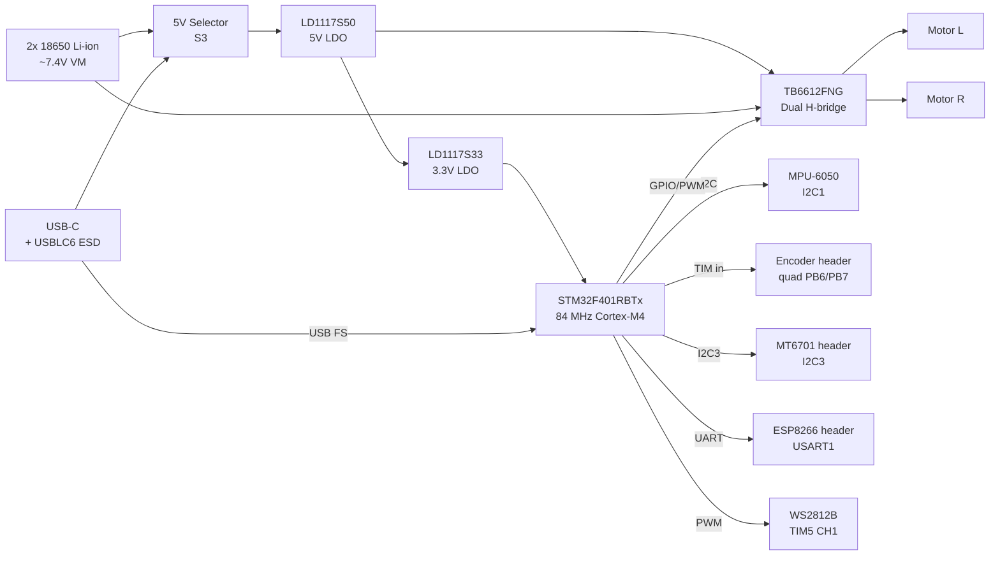
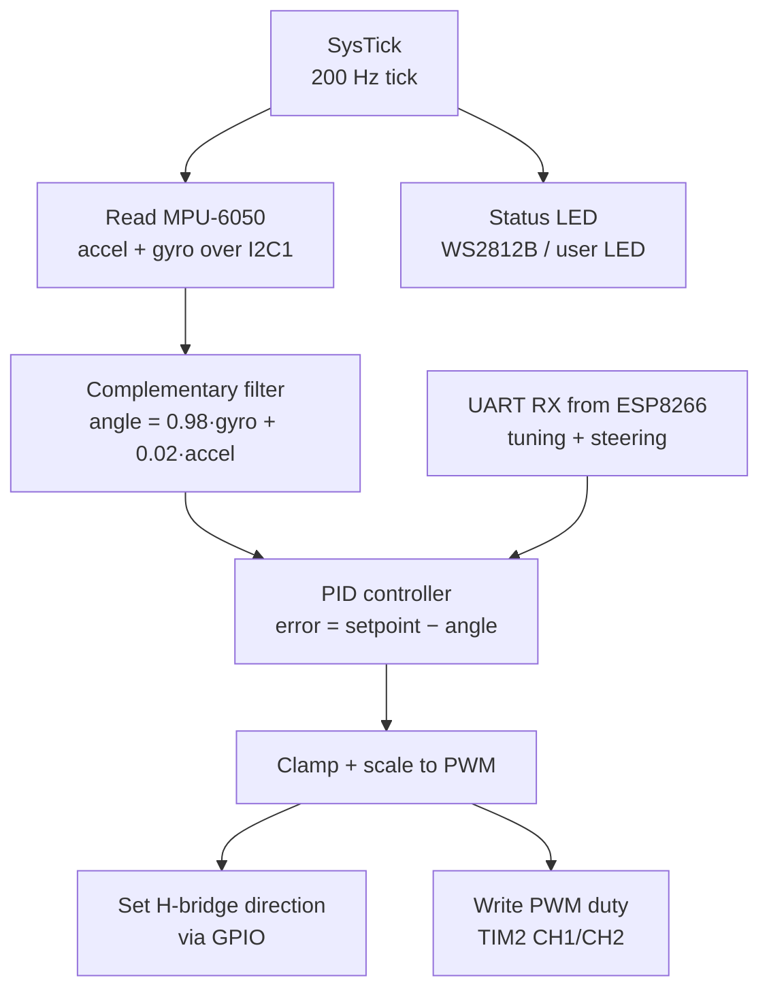
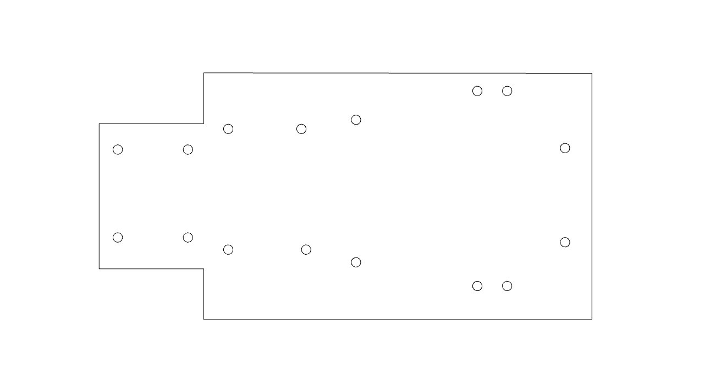
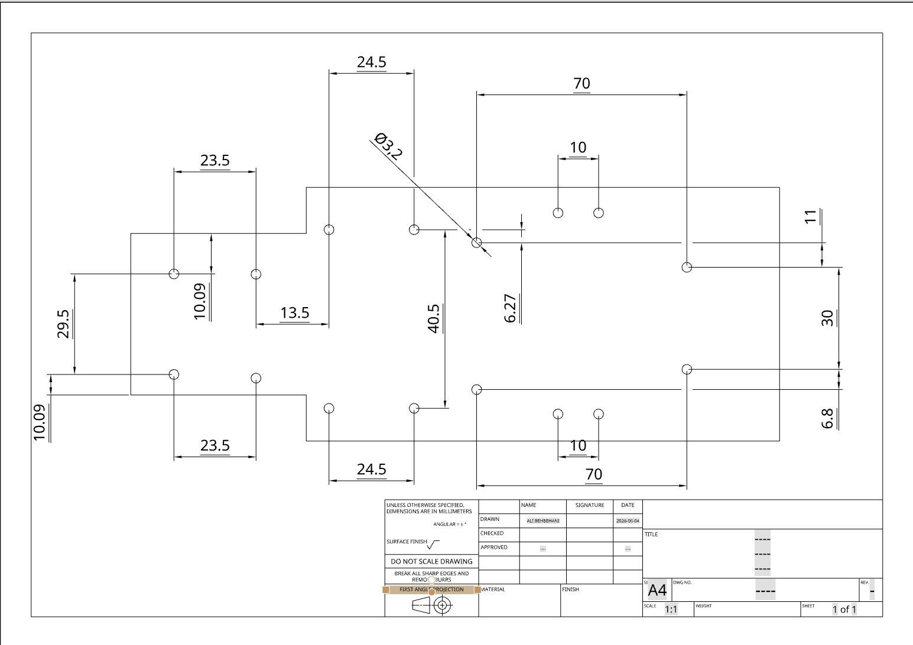
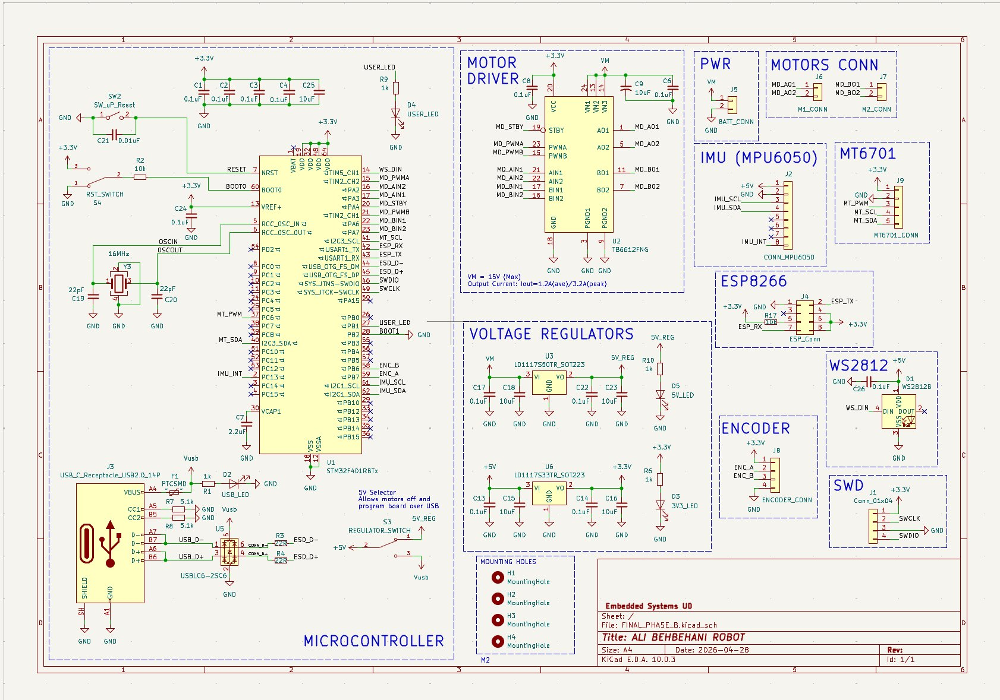
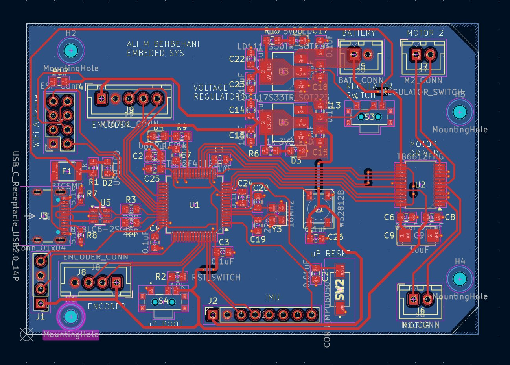
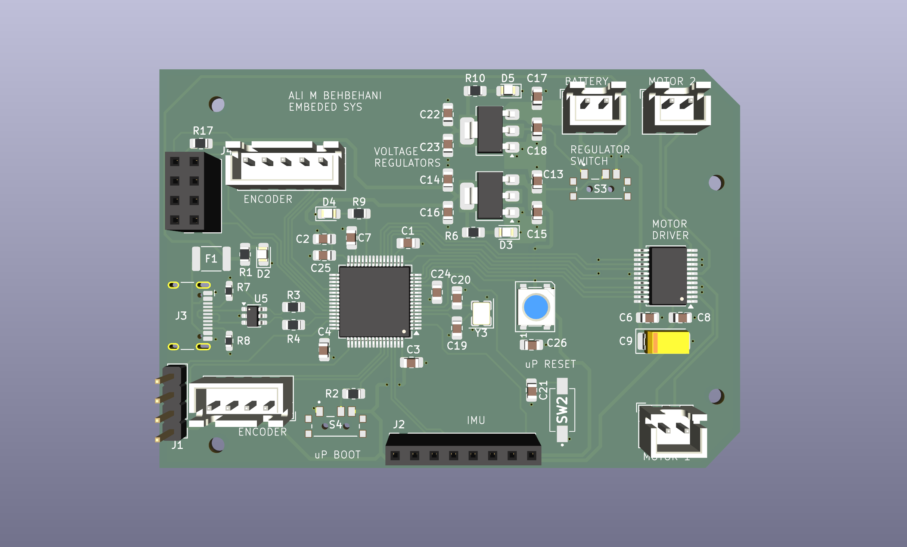
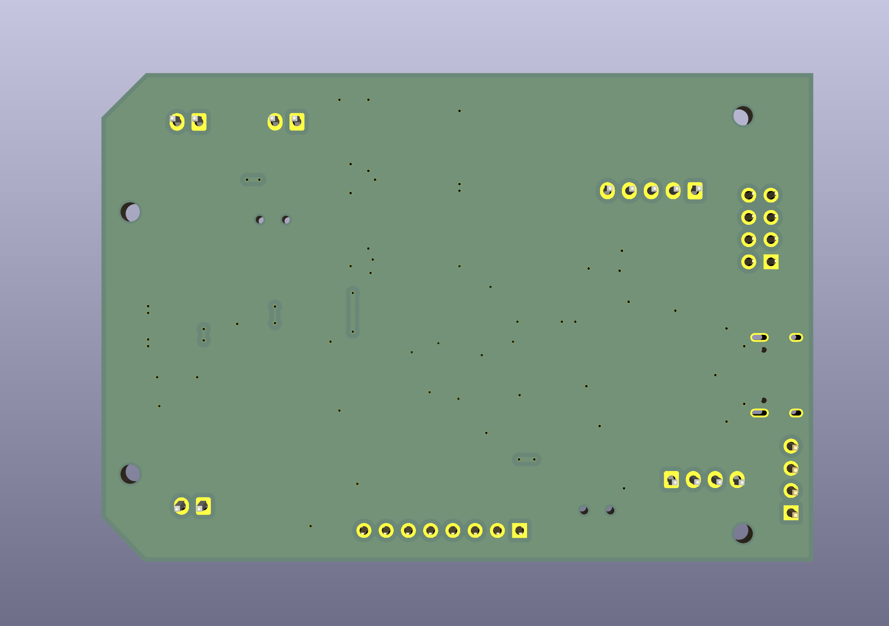
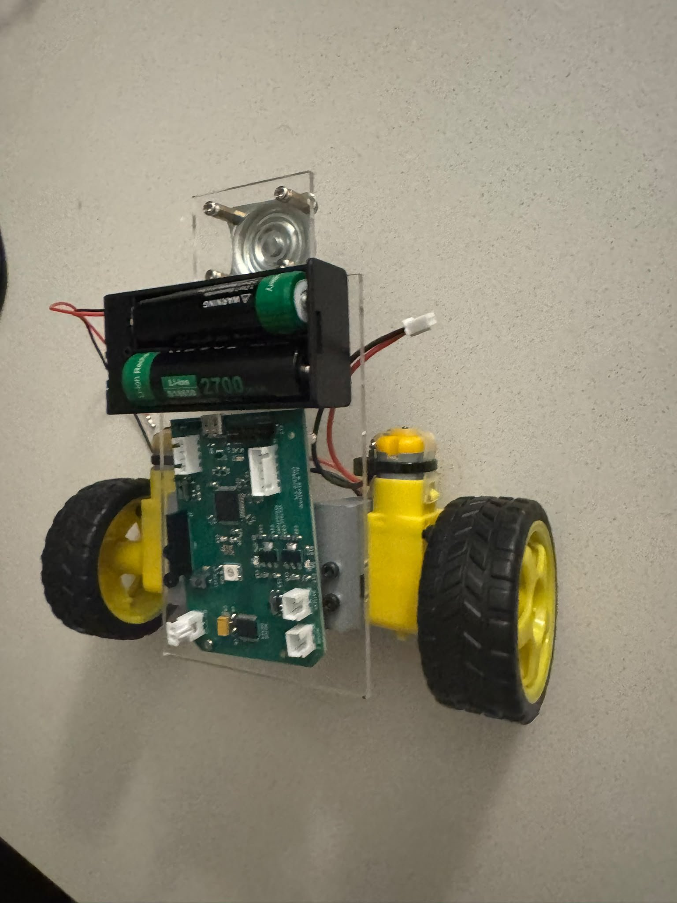
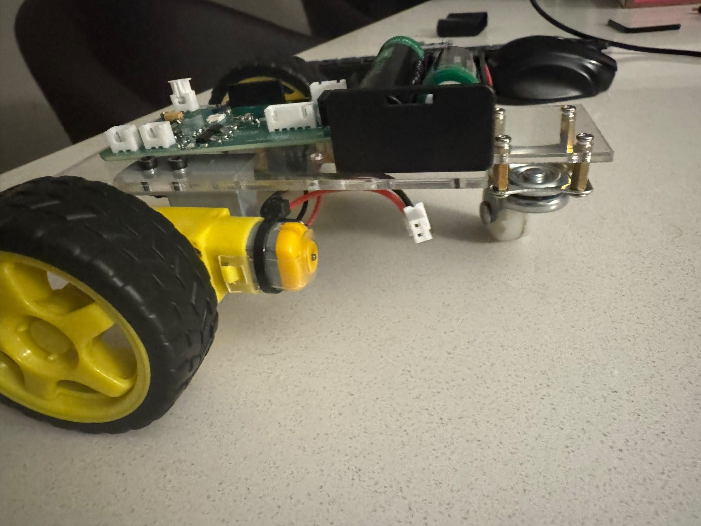

# Phase D — Final Documentation

**Project:** Two-wheel self-balancing robot
**Class:** Embedded Systems, University of Denver
**Author:** Ali Behbehani

## What I built

A two-wheel robot with a third ball-caster wheel for the demo, designed to eventually run as a self-balancing two-wheeler like a tiny Segway. The build covers the full embedded-systems stack: a custom STM32 PCB I designed in KiCad and hand-assembled, a laser-cut acrylic chassis I drew up in SolidWorks, two TT gearmotors, and a 2-cell 18650 battery pack.

## Current state

Being honest about where I am as of the demo deadline:

| Stage | Status |
| --- | --- |
| Schematic + PCB design (KiCad) | Done |
| PCB fabrication (JLCPCB) | Done |
| Hand-assembly with hot air + iron | Done |
| Power rail verification (3.3 V, 5 V, VM) | Done |
| Chassis design (SolidWorks) | Done |
| Laser-cut acrylic chassis | Done |
| Motor brackets (3D printed) | Done |
| 18650 battery holder mounted | Done |
| Custom 3D-printed M2 standoffs (workaround) | Done |
| Official spacers from instructor | Awaiting pickup |
| Firmware: 3-wheel drive code (instructor-provided `3Wheel_Balance_noEncoder`) | Not yet flashed — planned for demo day |
| Firmware: 2-wheel balance (IMU + PID) | Stretch goal for after the 3-wheel demo |
| Encoder integration | Skipped (requires extra soldering, not needed for balance per instructor) |
| ESP8266 wireless module | Headers populated, module not installed yet |

This document covers the design and assembly work that's complete, the problems I hit and how I solved them, and the plan for finishing the firmware integration on demo day.

## Design Stage

Following the format from the engredu reference article, the design stage starts with a block diagram of what the system needs, then narrows down to the MCU and peripheral choices.

### Block diagram

At a minimum the robot needs two motors, a driver to control them, an IMU for tilt sensing, and a power path from the battery to logic and motor rails. I also added an encoder header, a magnetic angle sensor header, a WiFi module connector, and a USB-C port for power and programming — so the same board can scale from a basic 3-wheel demo up to a full 2-wheel balancing platform with wireless tuning.



### MCU choice

The microcontroller is an [STM32F401RBTx](https://www.st.com/en/microcontrollers-microprocessors/stm32f401rb.html), 64-pin LQFP, 84 MHz Cortex-M4. Picked for:

- Enough pins (64) to route everything: two I²C buses, a UART for the ESP, USB FS, a couple of PWM timer channels, four direction GPIOs for the H-bridge, encoder inputs, plus debug.
- Native USB DFU bootloader in ROM → I can flash over USB-C without an ST-Link.
- Plenty of headroom for a 200 Hz IMU + PID loop with room to grow.
- Same chip family as the dev boards I'd used in earlier labs, so the HAL and toolchain are familiar.

I considered the STM32F103 (cheaper) but ruled it out because the F401 has the USB DFU bootloader built in and an FPU, which makes the floating-point math in the complementary filter cheap.

### Peripheral selection

Pins were picked so each peripheral lands on a hardware block that supports its function natively — no bit-banging:

| Peripheral | Used for | Pins |
| --- | --- | --- |
| I²C1 | MPU-6050 IMU | PB6 SCL, PB7 SDA |
| I²C3 | MT6701 magnetic encoder (optional) | PA8 SCL, PC9 SDA |
| TIM2 CH1/CH2 | Motor PWM (L + R) | PA15, PB3 |
| TIM5 CH1 | WS2812B addressable LED | PA0 |
| USART1 | ESP8266 link | PA9 TX, PA10 RX |
| USB FS | Flashing + future host comms | PA11 D−, PA12 D+ |
| GPIO | H-bridge direction + standby | PA2, PA3, PA4, PA6, PA7 |
| SWD | Debug header J1 | PA13 SWDIO, PA14 SWCLK |

The full pin-to-net mapping pulled straight from the KiCad project is in the [Pinout](#pinout) section further down.

### Code diagram

This is what the firmware structure looks like for the balancing case (the 3-wheel demo skips the filter and PID and just drives the motors from UART commands).



## The chassis

I designed the chassis in two tiers from 3mm clear acrylic so I could fit everything compactly. The bottom layer holds the PCB and the two motors. The top layer holds the battery pack. There's a small ball-caster looking piece at the back that I'm using more as a counterweight than as an actual third wheel.

The motors are TT gearmotors with the standard yellow 65mm wheels. They sit in 3D-printed brackets that screw to the bottom deck.

Everything is held together with M2 hardware on the PCB and M3 (3.2mm clearance) on the chassis itself.

I drew the chassis up in SolidWorks before sending the DXF to the laser. The dimensioned drawing is in `Final-Project/mechanical/`:





Key dimensions:
- Overall: roughly 140 mm × 70 mm with a notch at the front for the motor bracket clearance.
- 4 PCB mounting holes on a 23.5 mm × 40.5 mm rectangle pattern.
- 4 battery-holder mounting holes on a 10 mm × 30 mm pattern at each end.
- Motor mount cutouts on the left/right sides.
- All circular holes Ø3.2 mm for M3 hardware.

### Paper prototype before cutting acrylic

Before any acrylic was cut, the instructor required us to validate fit on paper. I exported the chassis outline at 1:1 scale, auto-printed it on a sheet of paper, and laid the PCB, battery holder, motors, and ball-caster on top to confirm every hole pattern, every cutout, and every clearance matched the real parts. Cheap and fast way to catch a dimension mistake before wasting acrylic. Once the paper version passed, the same DXF went to the laser.

Instructor's chassis validation video: https://youtu.be/5C3L4LZVVkk

## The PCB

Two-layer board, designed in KiCad 10. I assembled it by hand with hot air and a soldering iron, which meant a few joints needed rework after the first power-on (you can see the touched-up spots in the side photo).






The main components:

- **MCU:** STM32F401RBTx — 84 MHz Cortex-M4, LQFP-64. Programmed over SWD with an ST-Link.
- **Motor driver:** TB6612FNG — dual H-bridge, up to 1.2 A average / 3.2 A peak per channel, separate PWM and direction pins.
- **IMU:** MPU-6050 on a breakout board, plugged into the on-board connector. I²C1 at the default 0x68 address. There's also an interrupt line wired back to PC13.
- **Regulators:** LD1117S33TR (3.3 V) and LD1117S50TR (5 V) LDOs in SOT-223.
- **Clock:** 16 MHz crystal (Y3) on OSC_IN/OSC_OUT, with 22 pF load caps.
- **USB-C:** USB 2.0 receptacle with a USBLC6-2SC6 for ESD protection and series 22Ω resistors on D+/D−. USB DM/DP go to the STM32's USB FS pins so the board can be powered or talked to over USB-C.
- **5V Selector switch (S3):** lets me pick whether the 5V rail comes from the battery (VM) or from USB. Setting it to USB cuts motor power so I can flash and debug safely without the wheels spinning.
- **Status LEDs:** USB, 3V3, 5V, user LED, plus a WS2812B addressable RGB LED on a TIM5 PWM pin for fancier status indication.
- **Protection:** PTC fuse (F1) on the USB input rail.
- **Buttons:** reset (SW2) and boot0 (S4).
- **SWD header (J1):** 4-pin Conn_01x04 for ST-Link (SWDIO, SWCLK, GND, 3.3V).

The board also has connectors I designed in but didn't end up using for this build:

- **ENCODER_CONN (J8)** — 4-pin header for quadrature wheel encoders (ENC_A on PB7, ENC_B on PB6, 3.3V, GND). My TT gearmotors don't have encoders, so this never got hooked up.
- **MT6701_CONN (J9)** — 5-pin header for an MT6701 magnetic angle sensor on I²C3 plus a PWM line.
- **ESP_Conn (J4)** — header for an **ESP8266** WiFi module on USART1 TX/RX. The silkscreen even has a "WiFi Antenna" cutout reminder. Plan was wireless telemetry/PID tuning, but it's parked for next iteration.

Power: two 18650 Li-ions in series, about 7.4 V nominal, into the battery JST. From there VM feeds the 5 V LDO (which also feeds the motor driver's logic side), and the 5 V rail feeds the 3.3 V LDO which powers the MCU and IMU. The motors run directly off the battery rail through the H-bridge. No on-board charger — cells are charged externally.

## The spacer story

This one cost me a few hours. The mechanical plan assumed I'd be using M3 standoffs to mount the PCB to the chassis. When the board came back I realized the mounting holes (H1 through H4) were drilled at 2.2mm, which is M2, not M3. The standoffs I'd bought were way too big.

Re-spinning the board wasn't realistic with the deadline coming up, and even if I dropped in M2 standoffs the board still wouldn't sit flat on the deck — the bottom-side solder joints would touch the acrylic and short something out.

So I designed a tiny custom spacer and 3D-printed four of them: 2.4mm inner diameter so an M2 screw slides through, 5mm outer diameter, and 2.2mm tall. The 2.2mm height was the smallest I could get away with that still cleared the joints. PLA at 100% infill. Total print time was a few minutes. STL is in the repo.

## Firmware

I'm not writing firmware from scratch for this build. The instructor provided a working STM32CubeIDE project called `3Wheel_Balance_noEncoder` that targets the same STM32F401RB and uses the same peripheral assignments my board has, so the plan is to import it and flash it.

- **Instructor's walkthrough video** (project import + USB flashing): https://youtu.be/xApW40-5goQ
- **Project files:** `Phase_D/firmware/3Wheel_Balance_noEncoder/` *(add the unzipped project here once imported)*

### Flashing path: USB DFU (no ST-Link needed)

Because the board has USB-C wired straight to the STM32's USB FS pins, and the F401 has a USB DFU bootloader in ROM, I can flash without external hardware. The board also has a 5V Selector switch (S3) that was added specifically for this — flipping it to USB kills the motor rail so nothing spins while I'm programming.

The procedure:

1. Flip **S3 (5V Selector) to USB** — cuts motor power.
2. Plug USB-C from board to laptop.
3. Hold **BOOT0 (S4)**, tap **RESET (SW2)**, release BOOT0 → chip is in DFU.
4. Open **STM32CubeProgrammer**, connection type **USB**, click Connect.
5. Drag in the `.hex` from the built CubeIDE project, click Download.
6. Tap RESET to run.

### Peripherals the firmware uses

I²C1 for the MPU-6050 (with PC13 as interrupt), TIM2 CH1/CH2 for the motor PWMs, GPIOs PA2/PA3/PA6/PA7 for the H-bridge direction pins, PA4 for the driver standby/enable, PB1 for the user LED, and TIM5 CH1 for the WS2812B status RGB.

### 3-wheel vs 2-wheel mode

The instructor said the 3-wheel code is the primary demo target — the ball-caster on the rear acts as the third support so the robot just drives around without needing to balance. If that runs cleanly, the stretch is to swap in the 2-wheel balance code, which uses the IMU + a complementary filter + a PID loop on tilt angle. The encoder isn't required for that — the instructor said balance can be done with IMU values alone.

PID gains will be tuned on demo day and filled in here afterward.

## Communications (planned)

The ESP8266 module isn't installed on my board yet (header is populated, module pending), so the wireless control path is documented here as planned rather than working.

When the ESP is installed, it acts as a Wi-Fi access point and a bridge between the user's browser and the STM32 over UART (USART1).

Command protocol from ESP8266 → STM32:

| Char | Action |
| --- | --- |
| `w` | Move forward |
| `s` | Move backward |
| `a` | Turn left |
| `d` | Turn right |
| `x` | Stop |

Telemetry from STM32 → ESP8266:

```
$speed,roll,pitch,counter\n
```

## Robot interaction (planned)

To control the robot once the ESP8266 is installed:

1. On a phone or laptop, open Wi-Fi settings and connect to the access point `3Wheel Remote Controller`.
2. Open a browser and go to `192.168.4.1`.
3. The web GUI loads — arrow keys drive the robot, and the page shows live telemetry (encoder counts, roll, pitch).

## Where I am now

The hardware side is done. Board is designed, fabricated, hand-assembled, and the power rails are all reading correctly under load. The chassis is laser-cut, motors are mounted, battery holder is on top, and the 3D-printed M2 spacer workaround is keeping the PCB lifted off the deck.

What's not done yet: the official spacers from the instructor (picking those up at the demo) and the firmware flash. The firmware is a known quantity — it's the instructor's tested code — so the remaining risk is on the mechanical side (does it physically hold together with the official hardware) and on whether the 2-wheel balance attempt converges if I get that far.

## Problems and fixes

This is the part where I'm being honest about what went wrong. Every one of these cost me time and most of them taught me something I wouldn't have learned if the build had just worked first try.

### 1. PCB mounting holes were the wrong size

The mechanical plan I drew up assumed M3 standoffs. When the board came back from fab I tried to drop it onto the chassis and the screws wouldn't go through. I measured the holes in KiCad — H1 through H4 were drilled at 2.2mm, which is the clearance for an M2, not M3. I'd missed it in the design review.

Re-spinning the board wasn't an option with the deadline coming up. Switching to M2 hardware fixed the screw problem, but the board still wouldn't sit flat on the deck because the bottom-side SMD joints would touch the acrylic and short out.

**Fix:** designed a custom 3D-printed spacer in CadQuery — 2.4mm ID for the M2 to slide through, 5mm OD for surface area, 2.2mm tall (just enough to clear the joints). Printed four in PLA at 100% infill in maybe five minutes. STL is in the repo. Honestly the spacers turned out cleaner than the off-the-shelf ones would have been.

**Lesson:** double-check the drill size on every mounting hole before sending the board off. KiCad shows it in the status bar when you click the pad — would have caught this in two seconds.

### 2. Regulator output was unstable on first power-on

First time I powered the board the 3.3V rail was bouncing around. The MCU wouldn't boot reliably.

**Fix:** reflowed the buck IC with hot air. One pin wasn't fully wetted — you couldn't see it without a magnifier. Rail came up clean after that.

**Lesson:** when something doesn't work after assembly, look at the joints under magnification before you start swapping components or rewriting code.

### 3. Anticipated: 2-wheel balance will be hard with these motors

I haven't run the balance code yet, but I expect it to struggle, and it's worth documenting why ahead of time so the troubleshooting on demo day is faster.

Three things are working against me:

- **Motor backlash.** TT gearmotors have noticeable slop in the gear train and a deadband at low PWM. Small PID corrections won't move the wheels until the output is big enough to overcome the gearbox — by then the angle has already gone too far. These motors are great for hobby cars and bad for balance.
- **High center of mass.** The batteries sit on the top deck. Higher CoM is actually easier in theory (longer time constant), but it asks for more torque from the wheels.
- **Single-loop PID with no velocity feedback.** Without encoders I only have tilt angle to work with. A cascade controller with a position outer loop would be much more robust, but that's out of scope for this build.

**Plan for demo day:** start Kp small, raise it until oscillation begins, then add Kd to damp it. Ki stays 0 unless there's steady-state drift. If it doesn't converge within reasonable tuning effort, the 3-wheel demo is the primary deliverable anyway.

### 4. Anticipated: PID tuning loop will be slow without wireless

Every gain change requires editing `main.c`, building, flipping the 5V Selector, plugging USB, DFU-flashing, unplugging, flipping the selector back, and re-trying. That's a couple minutes a try and you need many tries.

**Partial mitigation:** define the PID gains as `#define` constants at the top of `main.c` so I only have to touch one block of code per try.

**Future fix:** install the ESP8266 module (header is already on the board) and expose PID gains over WiFi. Then I can tune live without re-flashing.

### 5. *Add any other problems you ran into here*

Things worth documenting if they happened: motor wire polarity reversal, IMU axis orientation issues, ground loops or noise on the 3.3 V rail, button bounce, DRC violations you had to clean up, footprint errors caught during assembly. Photos and screenshots of these are worth a lot of points.

## If I were doing it again

Add wheel encoders (or swap the TT motors for ones that come with encoders) so the controller has velocity feedback, not just tilt. Move the battery to the bottom deck and put the PCB on top to drop the CoM. Add a UART or Bluetooth channel to tune PID gains live. Maybe split it into a cascade controller — outer loop on position, inner loop on angle — instead of a single PID. And upgrade the IMU to one with onboard sensor fusion so I don't have to trust my complementary filter.

## Phase-by-phase timeline

The project was broken into four phases over the quarter:

**Phase A — Concept and requirements.** Picked the project (a balancing robot), wrote up what it had to do (stay upright on two wheels, no tether, run off batteries), and put together a block diagram and a parts shortlist.

**Phase B — Schematic and PCB.** Designed the schematic in KiCad, picked footprints, laid out the board, ran DRC, generated gerbers, and sent the board out for fab. This is the folder `Phase_B_Final_Board/FINAL_PHASE_B/` in the repo.

**Phase C — Assembly and bring-up.** Hand-assembled the board (hot air + iron), powered it on, fixed the reg-rail problem, got the ST-Link to flash the chip, and wrote the first cut of firmware to read the IMU and spin the motors.

**Phase D — Integration, tuning, documentation.** Mounted everything to the chassis (this is where the spacer issue showed up), got the PID loop running, attempted to balance, and wrote this document.

## Pinout

This is the real pinout pulled from the KiCad project (`FINAL_PHASE_B__1_.kicad_pcb`). The STM32F401RBTx is reference U1.

**Programming / debug**

| Pin | STM32 function | Net |
| --- | --- | --- |
| 46 | SWDIO | SWDIO |
| 49 | SWCLK | SWCLK |
| 7 | NRST | RESET (tied to reset button) |
| 60 | BOOT0 | BOOT0 |

**Clock**

| Pin | STM32 function | Net |
| --- | --- | --- |
| 5 | OSC_IN | OSCIN (16 MHz crystal) |
| 6 | OSC_OUT | OSCOUT (16 MHz crystal) |

**IMU — I²C1 + interrupt** (MPU-6050 on breakout)

| Pin | STM32 function | Net |
| --- | --- | --- |
| 61 | I2C1_SCL | IMU_SCL |
| 62 | I2C1_SDA | IMU_SDA |
| 2 | PC13 | IMU_INT |

**Motor driver — TB6612FNG**

| Pin | STM32 function | Net | Role |
| --- | --- | --- | --- |
| 15 | TIM2_CH2 | MD_PWMA | Motor A speed (PWM) |
| 17 | PA3 | MD_AIN1 | Motor A direction 1 |
| 16 | PA2 | MD_AIN2 | Motor A direction 2 |
| 21 | TIM2_CH1 | MD_PWMB | Motor B speed (PWM) |
| 22 | PA6 | MD_BIN1 | Motor B direction 1 |
| 23 | PA7 | MD_BIN2 | Motor B direction 2 |
| 20 | PA4 | MD_STBY | Driver enable (hold high to enable) |

**Wheel encoders (quadrature) — not used in this build**

| Pin | STM32 function | Net |
| --- | --- | --- |
| 58 | PB6 | ENC_B |
| 59 | PB7 | ENC_A |

**MT6701 magnetic angle sensor — I²C3 (not used in this build)**

| Pin | STM32 function | Net |
| --- | --- | --- |
| 40 | I2C3_SDA | MT_SDA |
| 41 | I2C3_SCL | MT_SCL |
| 37 | PC6 | MT_PWM |

**ESP32 link — USART1 (not used in this build)**

| Pin | STM32 function | Net |
| --- | --- | --- |
| 42 | USART1_TX | ESP_RX |
| 43 | USART1_RX | ESP_TX |

**USB-C — USB FS**

| Pin | STM32 function | Net |
| --- | --- | --- |
| 44 | USB_OTG_FS_DM | ESD_D− |
| 45 | USB_OTG_FS_DP | ESD_D+ |

**LEDs**

| Pin | STM32 function | Net |
| --- | --- | --- |
| 14 | TIM5_CH1 | WS_DIN (WS2812B addressable LED) |
| 27 | PB1 | USER_LED |

**Power**

| Pin | Function | Net |
| --- | --- | --- |
| 13 | VREF+ | +3.3V |
| 19, 32, 48, 64 | VDD | +3.3V |
| 12 | VSSA | GND |
| 18, 31, 47, 63 | VSS | GND |
| 30 | VCAP1 | Internal cap |
| 1 | VBAT | Tied off (no battery backup used) |

## Cost breakdown

Rough numbers from what I spent. These are USD and approximate.

| Item | Qty | Unit | Subtotal |
| --- | --- | --- | --- |
| Custom PCB (JLCPCB, 2-layer, 5 pcs) | 1 order | ~$5 | $5 |
| STM32F401RBTx (LQFP-64) | 1 | ~$5 | $5 |
| MPU-6050 breakout | 1 | ~$3 | $3 |
| TB6612FNG motor driver | 1 | ~$2 | $2 |
| LD1117S33TR + LD1117S50TR LDOs | 2 | ~$1 | $2 |
| USBLC6-2SC6 ESD protection | 1 | ~$1 | $1 |
| USB-C receptacle (14-pin) | 1 | ~$1 | $1 |
| WS2812B addressable LED | 1 | ~$0.50 | $0.50 |
| 16 MHz crystal + load caps | 1 set | ~$1 | $1 |
| Passives (R, C), LEDs, buttons, PTC fuse | mix | ~$5 | $5 |
| JST connectors + headers | mix | ~$3 | $3 |
| TT gearmotor + wheel | 2 | ~$4 | $8 |
| 18650 Li-ion cell (2700 mAh) | 2 | ~$7 | $14 |
| 2-cell 18650 holder | 1 | ~$2 | $2 |
| 3 mm clear acrylic sheet (laser cut at makerspace) | 1 | ~$5 | $5 |
| M2 hardware (screws, nuts, metal standoffs) | mix | ~$5 | $5 |
| PLA filament for spacers + motor brackets | small | ~$1 | $1 |
| **Total** | | | **~$63** |

> Update these with what you actually paid if you saved receipts (eFatoorah, hint hint).

## Photos

**Assembled robot:**




## References and datasheets

**Course references**
- engredu — 2-Wheel Balance Robot (instructor's writeup, used as report guideline): http://engredu.com/2026/05/01/2-wheel-balance-robot/
- Instructor video — chassis paper validation: https://youtu.be/5C3L4LZVVkk
- Instructor video — STM32CubeIDE import + USB flashing: https://youtu.be/xApW40-5goQ

**Interactive BOM**
- Open in browser: [iBOM](https://htmlpreview.github.io/?https://github.com/AMB0000/EmbeddedSystems/blob/main/Phase_D/iBOM/ibom.html)
- Source file: [Phase_D/iBOM/ibom.html](iBOM/ibom.html)

**Datasheets and tools**

- STM32F401xB/xC datasheet — https://www.st.com/resource/en/datasheet/stm32f401rb.pdf
- STM32F401 reference manual (RM0368) — https://www.st.com/resource/en/reference_manual/rm0368-stm32f401xbc-and-stm32f401xde-advanced-armbased-32bit-mcus-stmicroelectronics.pdf
- TB6612FNG dual motor driver — https://www.sparkfun.com/datasheets/Robotics/TB6612FNG.pdf
- MPU-6050 datasheet — https://invensense.tdk.com/wp-content/uploads/2015/02/MPU-6000-Datasheet1.pdf
- LD1117 LDO datasheet — https://www.st.com/resource/en/datasheet/ld1117.pdf
- USBLC6-2SC6 ESD protection — https://www.st.com/resource/en/datasheet/usblc6-2.pdf
- WS2812B addressable LED — https://cdn-shop.adafruit.com/datasheets/WS2812B.pdf
- ESP8266EX datasheet — https://www.espressif.com/sites/default/files/documentation/0a-esp8266ex_datasheet_en.pdf
- TT gearmotor specs (Adafruit) — https://www.adafruit.com/product/3777
- ST-Link V2 user manual — https://www.st.com/resource/en/user_manual/cd00262073.pdf
- KiCad 10 docs — https://docs.kicad.org/
- STM32CubeIDE — https://www.st.com/en/development-tools/stm32cubeide.html
- Phil's Lab (background on STM32 + PID for balancing) — https://www.youtube.com/@PhilsLab

## GitHub Repository

Direct links to the relevant folders in this repo:

- [KiCad project (schematic, PCB, gerbers)](../Phase_B_Final_Board/FINAL_PHASE_B)
- [Phase D folder (this report + supporting files)](.)
- [Interactive BOM](iBOM/ibom.html)
- [Pictures and screenshots](Pictures_Documentation)
- Firmware: instructor's `3Wheel_Balance_noEncoder` — see [Firmware_Tutorials](Firmware_Tutorials) for the import/flash walkthrough

Folder structure:

```
EmbeddedSystems/
├── Phase_B_Final_Board/FINAL_PHASE_B/   KiCad project (schematic, PCB, BOM)
├── Phase_D/
│   ├── README.md                        this report
│   ├── Pictures_Documentation/          schematic, PCB layout, 3D renders, chassis, photos
│   ├── iBOM/                            interactive BOM (open ibom.html in browser)
│   └── Firmware_Tutorials/              instructor video links + flashing notes
├── DMA_STM32/                           DMA experiments
├── Lab_01/                              early labs
├── All_Labs_CHALLENGE_COMPLETED/        challenge labs
└── Phils_Lab_Tutorial/                  reference tutorials
```
