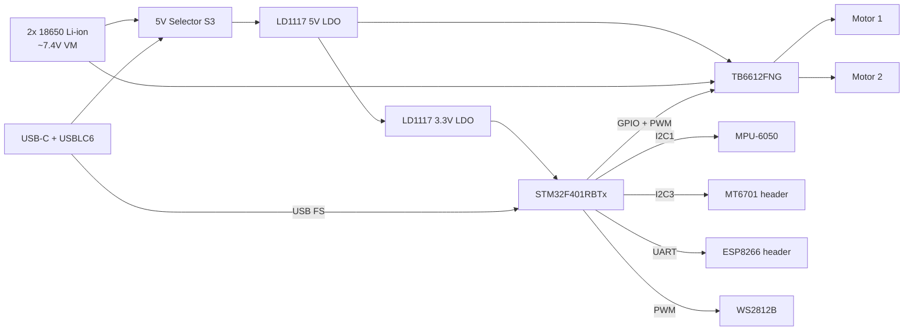
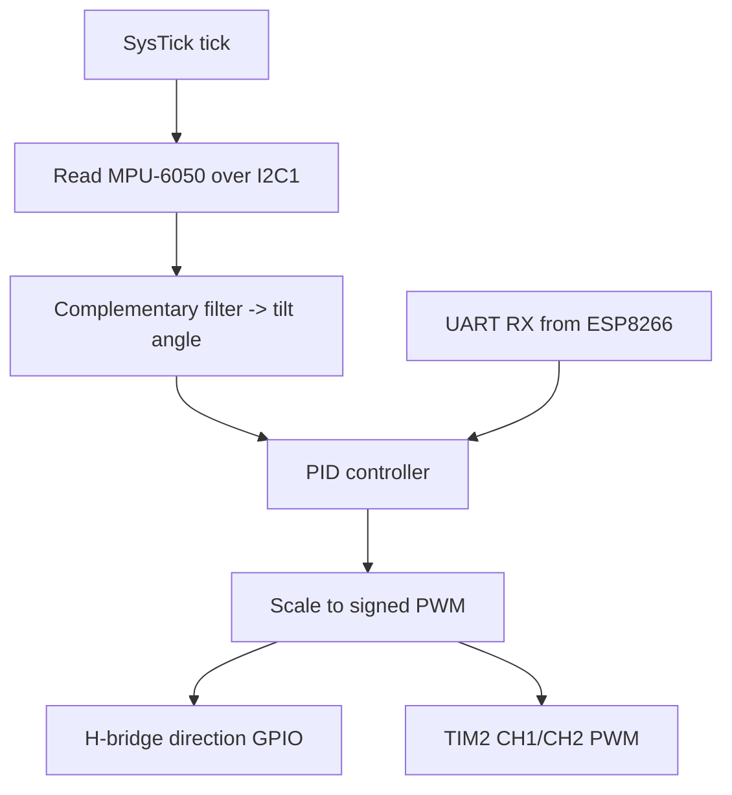

# 2 Wheel Balance Robot — Phase D

**Embedded Systems, University of Denver**
Ali Behbehani

## Introduction

This project is a 2-wheel balance robot built from scratch. It uses a custom PCB with a motor driver, IMU, encoder and magnetic-sensor headers, and a Wi-Fi module connector, plus a laser-cut acrylic chassis and two DC gearmotors. The robot starts as a 3-wheel design (a rear ball-caster acts as the third support) so all the components and code can be verified, and then extends to a 2-wheel balancing platform using the IMU and a PID controller.

This document covers the design, prototype, PCB, assembly, the 3-wheel stage, the 2-wheel balance stage, and the troubleshooting along the way.

## Design Stage

The design starts with a block diagram of the system. At a minimum it needs two motors, a driver (TB6612FNG), one IMU (MPU-6050), one magnetic encoder header (MT6701), an RGB LED (WS2812B), and a communication module (ESP8266).



The ESP8266 is intended to adjust the PID gains and steer the robot in real time. The user connects to the ESP8266's own Wi-Fi network, gets assigned an IP, opens a browser, and uses a simple GUI to interact with the robot. The ESP8266 talks to the STM32 over UART.

The microcontroller is an STM32F401RBTx (64-pin LQFP, 84 MHz Cortex-M4). It was chosen because it has enough pins and peripherals to interface everything (two I²C buses, UART, USB, timers/PWM, encoder inputs, and SWD), an FPU for the floating-point filter math, and a USB DFU bootloader in ROM so the board can be programmed over USB-C without an external programmer.

The pins were selected so each peripheral lands on a hardware block that supports it natively. The full pin-to-net mapping pulled from the KiCad project is in the [Pinout](#pinout) section.

The code diagram below shows how the firmware is structured to control the robot using the selected peripherals.



## Prototype Stage

Before cutting any acrylic, I validated the chassis design on paper. The chassis outline was printed at 1:1 scale and the real PCB, battery holder, motors, and ball-caster were placed on top to confirm every hole pattern and clearance matched the actual parts. Only after the paper version passed did I send the same DXF to the laser cutter.

## PCB Design

Two-layer board designed in KiCad 10.

### Schematics


### Layout


### 3D Rendering


### Interactive BOM

Open in browser: [iBOM](https://htmlpreview.github.io/?https://github.com/AMB0000/EmbeddedSystems/blob/main/Phase_D/Pictures_Documentation/ibom.html)
Source file: [ibom.html](ibom.html)

### Main components

- **MCU:** STM32F401RBTx — 84 MHz Cortex-M4, LQFP-64.
- **Motor driver:** TB6612FNG — dual H-bridge, 1.2 A average / 3.2 A peak per channel.
- **IMU:** MPU-6050 breakout on the on-board connector, I²C1, address 0x68, interrupt on PC13.
- **Regulators:** LD1117S50 (5 V) and LD1117S33 (3.3 V) LDOs.
- **Clock:** 16 MHz crystal (Y3) with 22 pF load caps.
- **USB-C:** USB 2.0 receptacle with USBLC6-2SC6 ESD protection, wired to the STM32 USB FS pins for power and DFU programming.
- **5V Selector (S3):** selects the 5 V source between battery (VM) and USB. On USB it cuts the motor rail so the board can be programmed safely.
- **LEDs:** USB, 3V3, 5V, user LED, and a WS2812B addressable RGB.
- **Protection:** PTC fuse (F1) on the USB input.
- **Buttons:** reset (SW2) and boot0 (S4).
- **Headers:** SWD (J1), encoder (J8), MT6701 (J9), ESP8266 (J4), motors (J6/J7), battery (J5).

## Assemble Stage

The board was assembled by hand using hot air and a soldering iron. After the first power-on, a few joints needed rework before all the rails came up clean. With the board powered, the 3.3 V, 5 V, and VM rails were verified with a multimeter before anything else was connected.

## 3 Wheel Robot

The goal of this stage is to confirm that all components and the PCB work before developing the balancing code. It tests the HAL drivers for the motors, the ESP8266 over UART, the IMU and encoder over I²C, and the RGB LED.

The firmware for this stage is the `3Wheel_Balance_noEncoder` STM32CubeIDE project, imported and flashed over USB.

Flashing procedure (USB DFU, no external programmer):

1. Flip the 5V Selector (S3) to USB — cuts the motor rail.
2. Plug USB-C from the board to the laptop.
3. Hold BOOT0 (S4), tap RESET (SW2), release BOOT0 → DFU mode.
4. Open STM32CubeProgrammer, connection type USB, Connect.
5. Load the `.hex` from the built project and Download.
6. Tap RESET to run.

### Chassis

The chassis is two tiers of 3 mm clear acrylic. The bottom deck holds the PCB and motors; the top deck holds the 18650 battery pack. A rear ball-caster acts as the third support for this stage. For simplicity, all chassis holes are M3 (Ø3.2 mm).


Key dimensions: roughly 140 mm × 70 mm overall; PCB mounting holes on a 23.5 mm × 40.5 mm pattern; battery-holder holes on a 10 mm × 30 mm pattern; motor mount cutouts on each side.

### Communications

The ESP8266 acts as a Wi-Fi access point and bridges the user's browser to the STM32 over UART (USART1).

Command protocol (ESP8266 → STM32):

| Char | Action |
| --- | --- |
| `w` | Move forward |
| `s` | Move backward |
| `a` | Turn left |
| `d` | Turn right |
| `x` | Stop |

Telemetry (STM32 → ESP8266): `$speed,roll,pitch,counter\n`

### Robot Interaction

1. Open Wi-Fi settings on a phone or laptop and connect to the access point `3Wheel Remote Controller`.
2. Open a browser and go to `192.168.4.1`.
3. The GUI loads — arrow keys drive the robot and the page shows live telemetry.

## 2 Wheel Balance Robot

This stage swaps in the balancing code, which uses only the IMU (no encoder needed). The control loop reads the MPU-6050, runs a complementary filter to estimate tilt angle, and drives a PID loop with the setpoint at upright (0°). The PID output is scaled to a signed PWM value — sign sets the H-bridge direction, magnitude sets the duty cycle — and sent to both motors.

PID gains are tuned by starting Kp small, raising it until the robot starts to oscillate, then adding Kd to damp the oscillation, with Ki left at 0 unless there is steady-state drift.

## Troubleshooting

### PCB mounting holes were the wrong size

The mechanical plan assumed M3 standoffs to mount the PCB to the chassis. When the board came back from fab, the mounting holes (H1–H4) were drilled at 2.2 mm — M2, not M3 — so the standoffs would not fit. Re-spinning the board was not realistic with the deadline, and even with M2 standoffs the board would not sit flat because the bottom-side joints would touch the acrylic and short.

**Fix:** designed and 3D-printed four custom standoffs — 2.4 mm inner diameter for an M2 screw, 5 mm outer diameter, 2.2 mm tall (the minimum that clears the bottom-side joints). Printed in PLA at 100% infill.

**Lesson:** check the drill size on every mounting hole before sending the board to fab.

### Hand-assembly rework

After the first power-on, the rails were not all stable. The cause was a solder joint that had not fully wetted, found under magnification. Reflowing it with hot air brought the rail up clean.

**Lesson:** when something does not work after assembly, inspect the joints under magnification before changing components or code.

### Balancing is hard with these gearmotors

The TT gearmotors have backlash and a deadband at low PWM, so small PID corrections do not move the wheels until the output is large, by which point the angle has already grown. The battery pack on the top deck also raises the center of mass, increasing the torque demand. With only an IMU and a single PID loop (no encoder velocity feedback), tight balance is difficult. The 3-wheel stage is the primary deliverable; balancing is the stretch goal.


## Pinout

Pulled from the KiCad project (`FINAL_PHASE_B__1_.kicad_pcb`). STM32F401RBTx is U1.

**Programming / debug:** SWDIO (pin 46), SWCLK (pin 49), NRST (pin 7), BOOT0 (pin 60)
**Clock:** OSC_IN (pin 5), OSC_OUT (pin 6) — 16 MHz crystal
**IMU (I²C1 + interrupt):** SCL (pin 61), SDA (pin 62), INT on PC13 (pin 2)

**Motor driver — TB6612FNG**

| Pin | Function | Net | Role |
| --- | --- | --- | --- |
| 15 | TIM2_CH2 | MD_PWMA | Motor A speed (PWM) |
| 17 | PA3 | MD_AIN1 | Motor A direction 1 |
| 16 | PA2 | MD_AIN2 | Motor A direction 2 |
| 21 | TIM2_CH1 | MD_PWMB | Motor B speed (PWM) |
| 22 | PA6 | MD_BIN1 | Motor B direction 1 |
| 23 | PA7 | MD_BIN2 | Motor B direction 2 |
| 20 | PA4 | MD_STBY | Driver enable |

**Encoder (not used this build):** ENC_B (pin 58), ENC_A (pin 59)
**MT6701 (not used this build):** I2C3_SDA (pin 40), I2C3_SCL (pin 41), MT_PWM (pin 37)
**ESP8266 — USART1:** TX (pin 42 → ESP_RX), RX (pin 43 → ESP_TX)
**USB-C — USB FS:** DM (pin 44), DP (pin 45)
**LEDs:** WS2812B data on TIM5_CH1 (pin 14), user LED on PB1 (pin 27)
**Power:** VDD pins 19/32/48/64 and VREF+ pin 13 → 3.3 V; VSS pins 18/31/47/63 and VSSA pin 12 → GND; VCAP1 pin 30

## References

- STM32F401 datasheet — https://www.st.com/resource/en/datasheet/stm32f401rb.pdf
- TB6612FNG — https://www.sparkfun.com/datasheets/Robotics/TB6612FNG.pdf
- MPU-6050 — https://invensense.tdk.com/wp-content/uploads/2015/02/MPU-6000-Datasheet1.pdf
- LD1117 — https://www.st.com/resource/en/datasheet/ld1117.pdf
- USBLC6-2SC6 — https://www.st.com/resource/en/datasheet/usblc6-2.pdf
- WS2812B — https://cdn-shop.adafruit.com/datasheets/WS2812B.pdf
- ESP8266EX — https://www.espressif.com/sites/default/files/documentation/0a-esp8266ex_datasheet_en.pdf
- KiCad 10 docs — https://docs.kicad.org/
- STM32CubeIDE — https://www.st.com/en/development-tools/stm32cubeide.html

  ## GitHub Repository

- [KiCad project (schematic, PCB, gerbers)](../../Phase_B_Final_Board/FINAL_PHASE_B)
- [Interactive BOM](ibom.html)
- [Pictures and screenshots](.)
- [Firmware notes](../Firmware_Tutorials)

## AI Usage

I have used AI to troubleshoot alot when running into a problem with code.  AI was used to help create Block Diagrams in this markdown file.


```
